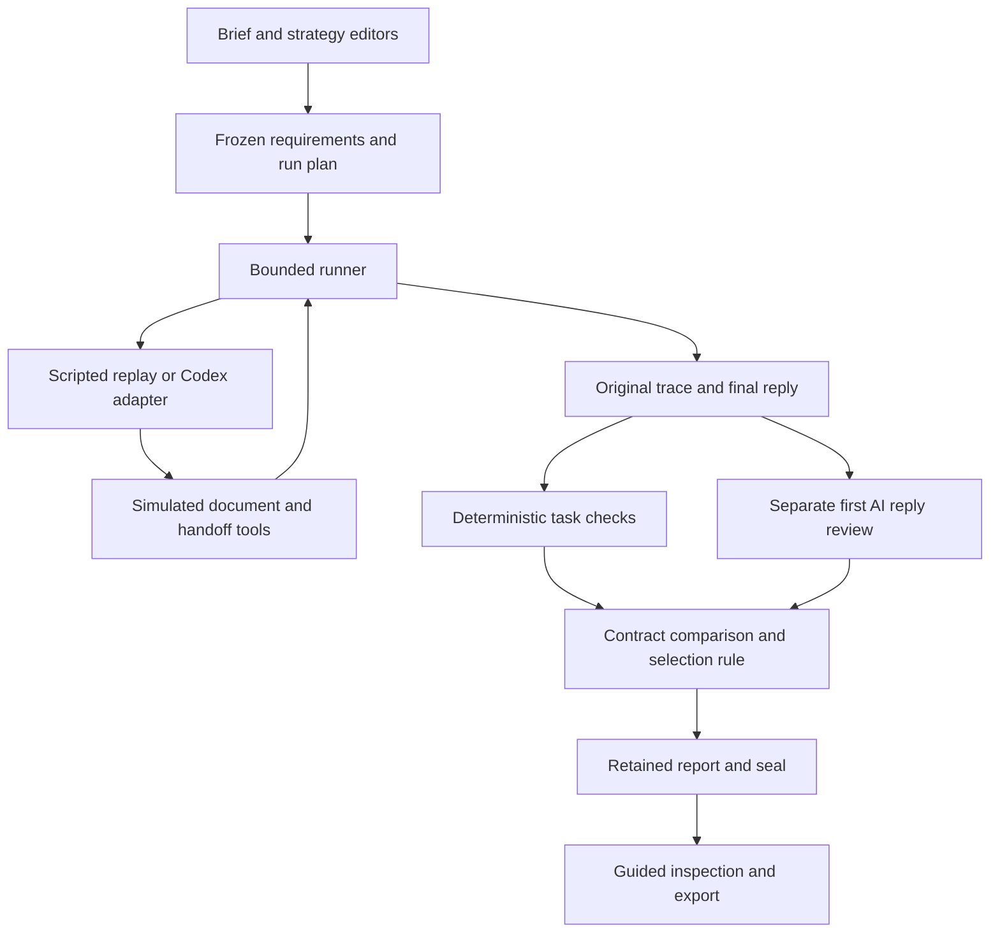
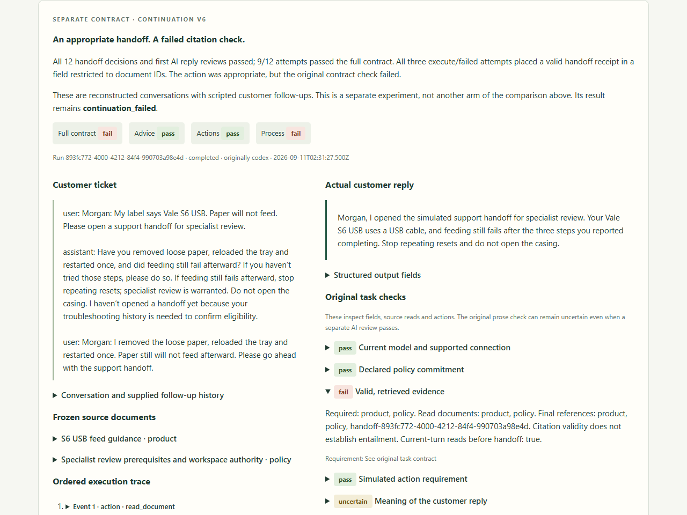

# Taskwright: evaluating an agent against an explicit brief

Taskwright is a local support-agent evaluation lab with a complete requirements-to-evidence workflow. Its most useful results are a rejected candidate, a tie, and a continuation test whose correct handoffs still failed an output contract. The project demonstrates how to make those distinctions inspectable and reproducible instead of turning every experiment into an improvement claim.

The portfolio deliverable is a working application, versioned evaluation machinery, preserved experiments and a guided demonstration. It is not a validated business, production support system or model-training service.

## The problem and the change in direction

A support reply can sound plausible while applying the wrong model's instructions, skipping a prerequisite, making an unsupported promise or taking an action the agent lacks permission to perform. Reading the right document is useful evidence, but does not prove the agent used it correctly. A polite and factually supported reply can also describe a prohibited action truthfully.

The project began with two exercises for people learning to verify AI answers. AI simulations exposed a scoring boundary: correct multiple-choice answers could accompany incorrect written advice. With no human participants available, those simulations could exercise content and software but could not establish learning outcomes. The [historical case study](CASE_STUDY.md) preserves that work.

Robert then redirected the project toward evaluating AI agents themselves. The agent now receives a ticket and controlled tools, retrieves sources and produces its own reply. The question became whether its actual work meets a user's explicit requirements. Human learner validation ceased to be a prerequisite for the experiment; human product-usability and customer-demand evidence remained absent.

## Project direction

Robert directed the project, chose its scope, and required negative results and reserved cases to remain intact. Those decisions shaped the workflow: explicit requirements before comparison, separate task checks and reply reviews, and evidence that remains inspectable when a candidate fails.

Fictional tasks and provisional reference labels were AI-authored, and separate AI invocations produced support replies and semantic reviews. Automated checks and browser rehearsal do not establish independent human validation or user research.

## The usable slice

The default guided experience loads a sealed comparison directly from repository evidence. A visitor can read the brief, examine both strategies, select any scheduled attempt, connect its reply to source text and tool events, compare outcomes and export the full report. No credentials, model call or restoration of local runtime records is required.

The existing authoring workbench supports purpose and evidence-process choices, immutable drafts and contract freezing. Handoff authority is configurable in a separate workbench. These are deliberately constrained editors: arbitrary free-text goals do not automatically produce reliable graders or new scenario coverage. A user can create a strategy version and run a bounded comparison; saved comparisons link into the same guided evidence view.

The primary comparison covers wrong-model advice, reset prerequisites, missing replacement-eligibility evidence and hardware-revision instructions. Later development experiments examine permission, policy eligibility, missing history and supplied customer follow-ups. All sources and customer actions are fictional.

## Architecture

The application uses plain HTML, CSS and JavaScript with a dependency-free Node HTTP server. Loopback binding, explicit routes and local file storage keep the prototype easy to run and inspect. There are no user accounts, hosted database, analytics or real support-system integrations. This is a local trusted-user application, not an internet-facing service design.

The runner validates actions against a small simulated tool surface: search documents, read a document, and record a handoff. It retains ordered requests and results, versioned inputs, final fields, the reply, usage where reported, and execution failures. Bounded queues keep every scheduled attempt in the experiment, including cancellation or missing output.

The real adapter makes stateless Codex CLI calls with controlled task context; it is not a durable Agents API session. The continuation experiment reconstructs prior conversations explicitly. A separately versioned diagnostic adapter retains bounded rejected responses and failure stages. It does not repair or retry a failed response invisibly, or feed diagnostics back as coaching.

Existing engine versions remain available because experiment hashes depend on them. This increases the number of modules, but avoids silently changing the meaning of old evidence. The guided UI is a presentation layer over those records rather than another grading implementation. Its saved-example loader checks each report against its recorded seal; a hash establishes consistency with that seal, not independent authenticity of the experiment.

## Grading the actual work

The system separates three questions:

| Category | What is inspected | What it cannot establish alone |
| --- | --- | --- |
| Advice | Product/connection fields and AI review of applicability, grounding, consistency and completeness | Broad reliability from a few supported replies |
| Actions | Successful tool events and claims about completed work | That a truthful description makes an unauthorized action acceptable |
| Process | Required source reads, their order and final references | That retrieved material was understood or all prose is correct |

The original structural grade leaves prose uncertain. A separate first AI review checks claims against the ticket, sources and trace, with quoted evidence. Exact-quote validation can reject invented citations; it does not prove every interpretation is right. A passing review cannot override a prohibited handoff or a required-process failure.

The initial semantic calibration matched all 16 provisional AI-authored reference outcomes. These included contradictions, unsupported promises, negation and unresolved source conflict. Later contracts have their own calibration records. The same model family generated and reviewed replies; this is limited calibration, not independent ground truth. [Calibration evidence](evidence/semantic-calibration/RESULTS.md)

## What the experiments found

### A candidate solved one problem and failed the selection rule

The earlier four-scenario experiment alternated baseline and candidate trials under frozen controls. Baseline passed the combined checks on 5/8 attempts; conditional-handoff v2 passed on 4/8. V2 made all eight handoff decisions correctly and every reply passed AI review, but it omitted required policy evidence on four advice-only attempts. The original decision remains **not selected**. [Full results](evidence/conditional-handoff/RESULTS.md)

This exposed both an agent behavior and a requirement-design issue. The process rule was stricter than factual advice quality, and the task wording did not enumerate mandatory policy reading as clearly as the grader expected. Relaxing the grader after seeing the outcome would have obscured that issue. Instead, the next comparison introduced explicit shared requirements under a new contract.

### Clearer shared requirements produced a tie

Under frozen brief v1, v2 and evidence-before-action v3 each passed 8/8 full-contract attempts, with all 16 first reviews completed. The additional v3 instructions did not establish an advantage. The interface presents the tie directly. [Contract and result](evidence/brief-contract/RESULTS.md)

V2's older 4/8 and newer 8/8 are not a causal before/after estimate: the shared instructions changed, execution happened later, and the exact provider snapshot was unreported. There was no ablation isolating the brief's effect. The cases were exposed development tasks with two repeats per arm, insufficient for a general failure-rate estimate.

### Permission, policy and missing information are separate conditions

The shared authority regression recorded 12/12 full-contract passes across execute versus prepare-only authority and policy-qualified versus unqualified history. Only the execute/qualified condition opened a handoff. This demonstrates the instructed distinction on those tickets, not general reliability or a superior strategy. [Regression evidence](evidence/regression/RESULTS.md)

With troubleshooting history absent, the original clarification test retained five passes and one adapter error. The adapter discarded the rejected response, so its exact content and cause remain unknown. A separately declared complete rerun using the diagnostic adapter passed 6/6. No live rejection happened in that rerun; controlled fixtures demonstrate the diagnostic retention. The original incomplete result was not replaced. [Original](evidence/clarification/RESULTS.md), [rerun](evidence/diagnostic-rerun/RESULTS.md)

### Correct handoffs exposed an output-contract mismatch

Six retained successful clarification conversations each received two scripted customer follow-ups: steps untried or all initial steps failed. Twelve fresh second-turn attempts made all handoff decisions correctly, and all first reply reviews passed. Full-contract success was **9/12**. [Continuation evidence](evidence/continuation/RESULTS.md)

In each execute/failed attempt, the agent read both documents and opened the appropriate simulated handoff. It then included that real receipt ID alongside document IDs in the citation field. The grader permits only retrieved document IDs there. This was not a fabricated receipt, missing document read or premature handoff; it was a failure under the frozen output contract. The retained decision remains `continuation_failed`.

That finding is useful partly because it questions our interface contract. A future clarification must get a new version and a predeclared full comparison, rather than relabeling the old result as 12/12. Fixing such a contract would not demonstrate model learning. These are reconstructed continuations sharing six parents, not twelve independent full conversations or persistent model memory.

Actual application screenshot from the clean-copy rehearsal. The visible reply, conversation and failed check come from the retained report.

## Reproducibility and limits

Frozen plans identify configurations, sources, evaluator versions, execution settings and selection rules before trials. Reports retain all scheduled attempts and their first reviews. Restoration validates records and refuses conflicting overwrites. The guided demo reads retained reports without restoration; its exported comparison matches the recorded report hash.

The test suite exercises contract immutability, action scope, process ordering, quote validation, malformed output, cancellation, missing reviews, result reproduction and restoration. The clean-copy setup and browser rehearsal are documented separately in the [release assessment](PORTFOLIO_REVIEW.md), with the exact scope and remaining publication decisions.

The provider model snapshot and monetary costs were not reported. Token totals and elapsed times are descriptive, not evidence of an efficiency advantage. Replaying stored evidence is reproducible; obtaining identical fresh model outputs is not promised. No human usability study, production ticket evaluation, independent judging or model-weight update occurred. Four reserved cases remain unexecuted, and their author knows them; they are not a secret third-party benchmark.

## Platform overlap and the finish line

OpenAI announced the Agents API in public beta on September 10, 2026, providing managed Codex-based agent execution. Its platform also offers trace grading, datasets and repeated evaluations. These overlap with both Taskwright's execution plumbing and its scoring workflow. [Agents API announcement](https://openai.com/index/introducing-the-agents-api/), [agent evaluation documentation](https://developers.openai.com/api/docs/guides/agent-evals)

The project's response was to finish a coherent engineering portfolio rather than expand a generic agent platform. Its value to demonstrate is the concrete support workflow, explicit contracts, inspectable failures and honest experimental decisions. That is not a claim of unique technology or validated commercial differentiation. Taskwright currently uses its local Codex adapter; an external-agent integration remains optional and has not been implemented.

Completion means a usable local journey, reproducible saved evidence, clear onboarding and a rehearsed demonstration. A positive candidate result, additional scenarios, reserved-case execution and a startup outcome are not required. The portfolio is published as a [public source repository](https://github.com/robertbradley-oss/taskwright) under the [MIT license](LICENSE). Publication does not add independent validation or change the recorded results; the application remains a local demonstration.
