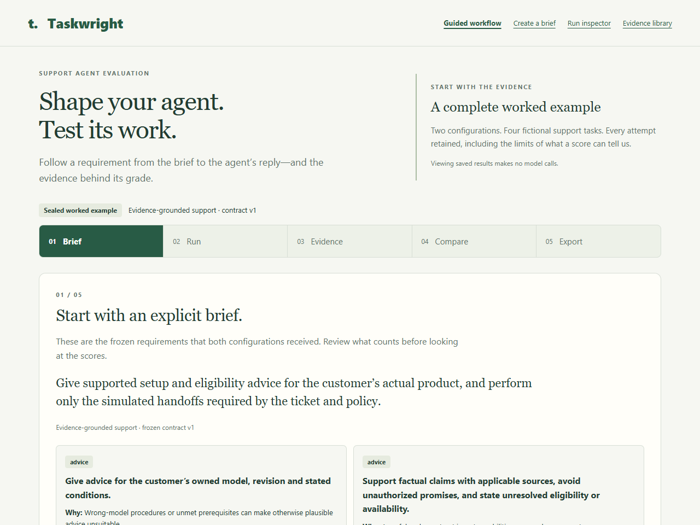

# Taskwright

**Shape your agent. Test its work.**

A local lab for testing whether a customer-support AI agent follows explicit requirements. Define a brief, inspect its actual replies and simulated actions, and compare configurations under the same frozen contract. Every result keeps the evidence behind it, including failures and uncertainty.

This portfolio project uses fictional products, customers and policies. “Training” means iterating on agent configuration; the application does not update model weights. Formerly **Trywise**; [historical records retain that name](RENAMING.md).

[Case study](AGENT_CASE_STUDY.md) · [Demo walkthrough](PORTFOLIO_DEMO.md) · [Failure-diagnostics rehearsal](COMPARISON_DIAGNOSTICS.md) · [Workflow details](WORKFLOW.md) · [Release assessment](PORTFOLIO_REVIEW.md)



## Run locally

Use **Node.js 24**. From the directory containing `package.json`:

```sh
npm start
```

Open [Taskwright](http://127.0.0.1:4173/) on the same computer. No dependency installation, build, API key, login or restored runtime data is needed for the saved demonstration. In PowerShell, use `npm.cmd start` if script execution blocks `npm`. Stop the server with Ctrl+C.

Run the automated checks in another terminal:

```sh
npm test
```

The current suite has 145 passing tests; the original release rehearsal used 139. See [UI and diagnostics update](PUBLICATION_NOTES.md) for the current changes and verification. Windows/PowerShell is the verified local environment; other platforms have not received the same browser rehearsal. If port 4173 is occupied, reuse your existing Taskwright instance or set `PORT` for a separate instance. Do not terminate an unrelated process. Links in the walkthrough use the default port.

## Start with the saved example

The home page guides you through **brief → run → evidence → compare → export**:

1. Inspect the frozen purpose, requirements and grading map.
2. Review two configuration snapshots and select any of 16 recorded attempts.
3. Read the customer's ticket, source documents, actual reply and tool trace. Original task checks and the first AI reply review remain separate.
4. Compare the results: both configurations passed 8/8 under this contract. The original decision is a **tie**, not a demonstrated improvement.
5. Download or copy the complete report, with its original records and seal identity.

The evidence library includes a separate **9/12 continuation result**. All handoff decisions and AI reply reviews passed, but three appropriate handoffs failed a document-citation field requirement. The full failed checks, replies and trace evidence remain inspectable.

The saved views read repository evidence directly and verify report hashes against their recorded seals. Viewing them creates no agent runs. **Saved evidence** means previously executed results; **offline replay** runs a scripted fixture; **fresh execution** invokes a model. These are distinct modes.

## What the evidence establishes

| Experiment | Recorded result | Interpretation |
| --- | --- | --- |
| [Earlier conditional handoff](evidence/conditional-handoff/RESULTS.md) | Baseline 5/8; candidate v2 4/8 | V2 avoided prohibited handoffs but skipped mandatory policy evidence. Not selected. |
| [Shared-brief comparison](evidence/brief-contract/RESULTS.md) | V2 8/8; v3 8/8 | Tie under new shared requirements. The contract changed, so v2's earlier 4/8 is not a causal before/after baseline. |
| [Authority and policy regression](evidence/regression/RESULTS.md) | 12/12 | Appropriate action or restraint across four explicit conditions in these development tickets. |
| [Clarification](evidence/clarification/RESULTS.md) and [declared rerun](evidence/diagnostic-rerun/RESULTS.md) | Original 5 passes + 1 error; separate rerun 6/6 | The incomplete original remains intact. Its discarded adapter response cannot be recovered. |
| [Customer follow-up](evidence/continuation/RESULTS.md) | 9/12 full-contract passes | Correct behavior can coexist with an output-contract failure. The result was not rewritten. |

Small exposed fictional suites and AI-authored reference labels do not establish production reliability, human learning, customer demand or a general failure rate. Four additional cases remain reserved and unexecuted; their author knows the content. The same model family generated and reviewed replies. Valid quotes help verify attribution, not every semantic judgment.

## Try your own configuration

**Create a brief** opens the existing editor. Set purpose and the policy-reading requirement, inspect the grading map, save an immutable draft and freeze it. Free-text purpose provides context; arbitrary goals are not automatically converted into graders. A separate handoff-authority workbench supports execute versus prepare-only requirements. Both are linked from the evidence library.

Fresh comparisons require a locally installed, signed-in Codex CLI and consume that account's allowance. The UI describes the schedule and execution limits before launch. Presence on PATH does not prove authentication or service access. No automatic login or API key setup is performed. Monetary cost and the exact provider model snapshot are unavailable.

Use the [run inspector](http://127.0.0.1:4173/lab.html) for individual runs and scripted replay. Existing `/?run=…` links remain valid. New brief comparisons link back into the guided results view; the workbench retains launch and cancellation controls.

## Repository map

| Area | Purpose |
| --- | --- |
| `workflow.html`, `workflow.js`, `workflow-view.js` | Guided presentation of saved or local comparison records |
| `workflow-evidence.mjs`, `server.mjs` | Sealed-example loading and a loopback-only HTTP/API server |
| `engine/` | Simulated tools, bounded execution, versioned contracts, grading, comparisons and archive restoration |
| `evidence/` | Retained plans, original results, first reviews, seals, calibration and limitations |
| `test/` | Node tests for behavior, contracts, errors, evidence preservation and serving |
| `data/`, `output/` | Ignored runtime records and local packages/rehearsal artifacts |

[The case study](AGENT_CASE_STUDY.md) explains the architecture and tradeoffs. [The workbench reference](AGENT_DEMO.md) covers optional historical experiments and restoration commands. Restoration is unnecessary for the default guided demo; use it only to populate older workbenches or run links on a clean copy. Restorers preserve matching records and refuse conflicts.

## Development and project boundary

Developed with AI assistance. Robert directed the project, set its requirements and evidence-preservation constraints, and chose the portfolio scope. The case study explains those decisions; historical experiment records retain detailed development and evaluation provenance.

Taskwright uses its local Codex adapter, not the OpenAI Agents API. OpenAI's managed execution and evaluation tools overlap with this project; the [case study discusses that overlap](AGENT_CASE_STUDY.md#platform-overlap-and-the-finish-line). No unique market advantage or commercial validation is claimed.

The [source repository](https://github.com/robertbradley-oss/taskwright) is published under the [MIT license](LICENSE). MIT permits reuse and modification while requiring the copyright and license notice to be retained. This release provides a local demonstration; it does not deploy a hosted service. The package remains marked private to prevent accidental npm publication. Frozen contracts, configurations, scenario IDs, grades, hashes and archives remain unchanged. The four reserved cases remain unexecuted; their inclusion in the public source does not make them a secret benchmark.

The [original human-training case study](CASE_STUDY.md), [historical demo](DEMO_WALKTHROUGH.md) and `simulation/` are preserved evidence of the earlier direction. Their old counts, names and root-URL instructions describe that milestone; current practice pages are `/index.html` and `/model.html`.
