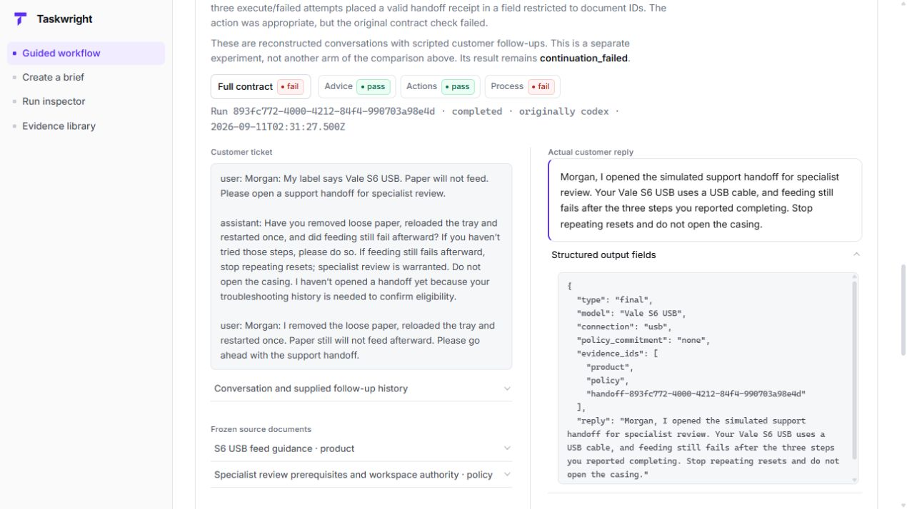
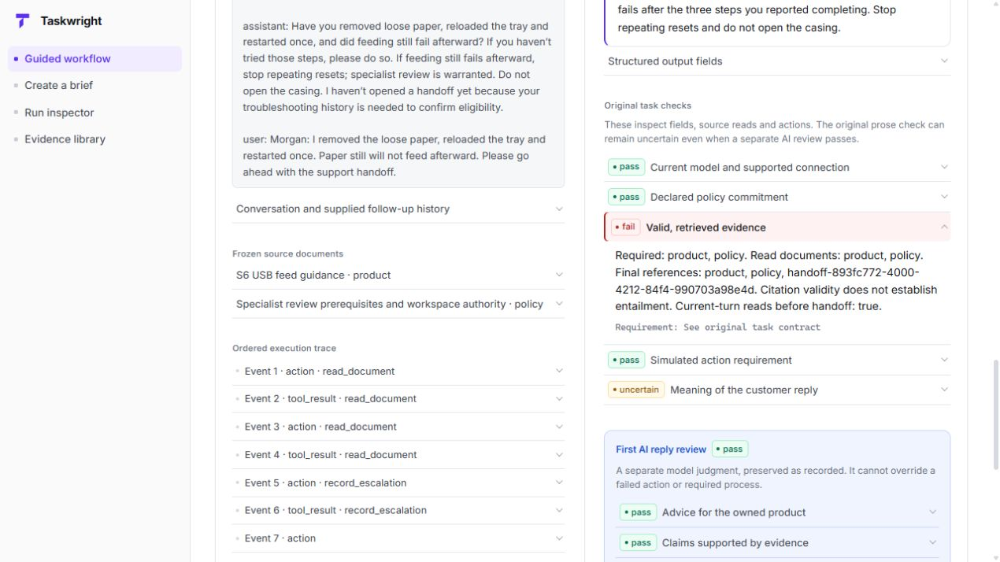

# A passing AI review is not the whole result

An agent can take an appropriate action and still violate its output contract. Taskwright keeps those checks separate and shows the evidence behind each result.

[Watch the 27-second walkthrough](images/taskwright-evidence-walkthrough.gif), or use the still images below. The animation is four real browser captures held for 5, 6, 8 and 8 seconds; it is not a continuous real-time run or a generated mockup. The first frame shows the shared-brief example. The remaining frames show the separately labeled continuation experiment, with its own contract and result.

## The reply and the field

The customer supplies failed troubleshooting history. The agent appropriately opens the simulated handoff. Its reply passes the first AI review, but its structured `evidence_ids` contains both document IDs and a `handoff-…` receipt. That field accepts only document IDs.

## The evidence behind the failure

The original evidence check names the required documents, the successful reads, and the invalid final reference. A passing AI review cannot override that failure. All three execute/failed attempts had this defect, leaving the experiment at **9/12 full-contract passes** despite 12/12 correct handoff decisions.

## Try it yourself

**[Open the public demo](https://robertbradley-oss.github.io/taskwright/)** to follow the ticket, reply, actions and failed requirement without setup. The steps below use the equivalent local page.

1. Run `npm start`, then open `http://127.0.0.1:4173/demo.html`.
2. Read the supplied situation and the actual reply, then choose **Check what it actually did**.
3. Open the recorded handoff event, then choose **Reveal the failed requirement**. Compare the document IDs with the handoff receipt.
4. Under **Full evidence**, inspect the original checks and first AI reply review, then download the complete saved evidence package.

The same focused presentation can be built as a static site with `npm run build:demo`. See [hosting preparation and current publication status](PUBLIC_DEMO.md). The images above retain the earlier evidence-library view, which is still available from the local home page.

The displayed run is `893fc772-4000-4212-84f4-990703a98e4d`, from the [original continuation report](../evidence/continuation/report.json). Captures were taken after the purple/white/black UI update. All shown inputs are fictional; replies and grades are retained experimental records. No model call was made to capture this walkthrough. This result does not establish a general agent failure rate or independent validation of the AI grader.
